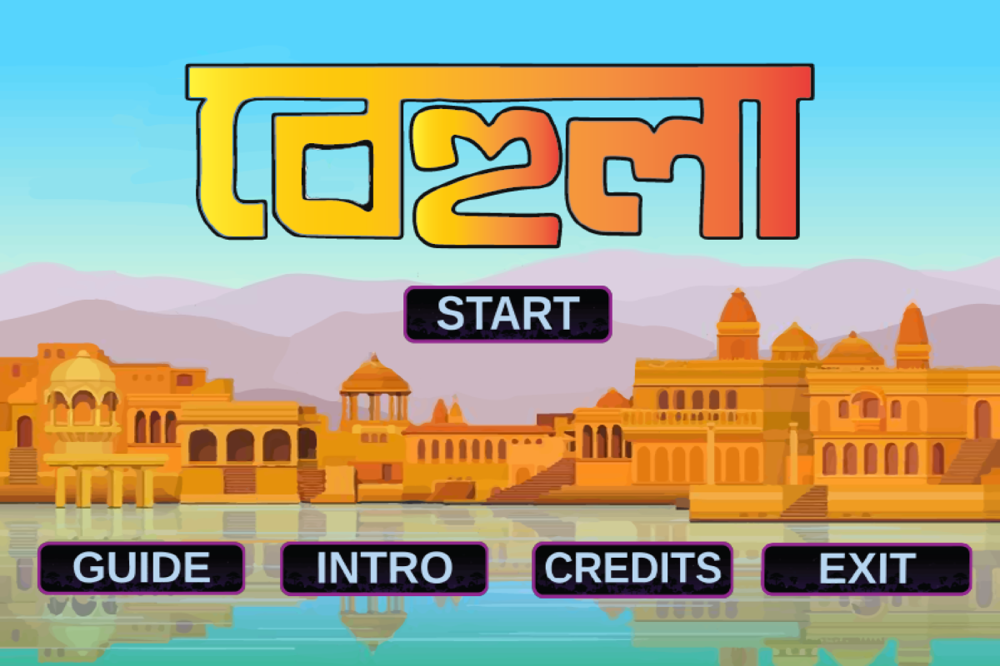
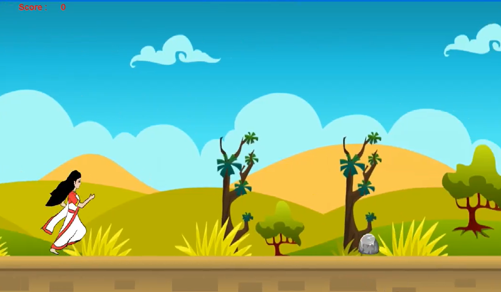
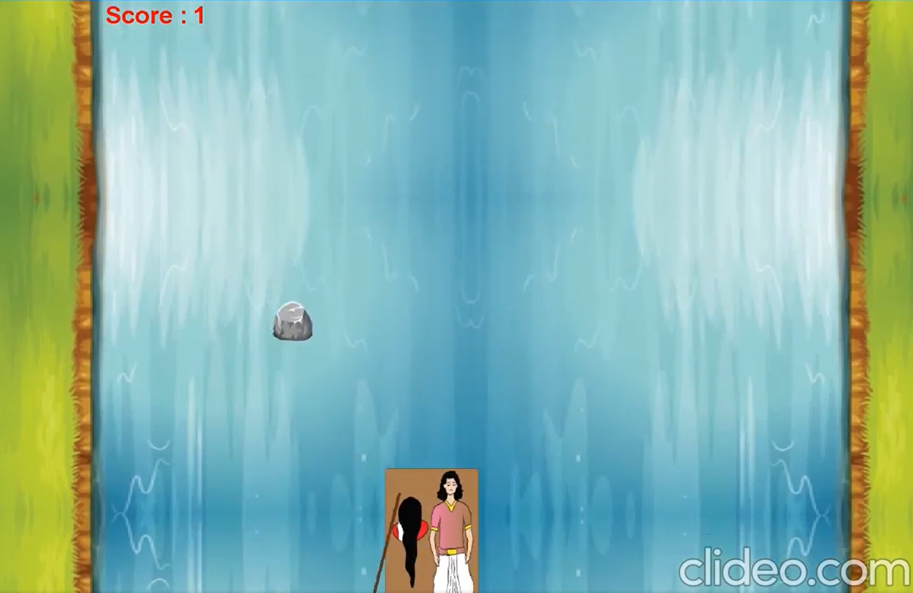
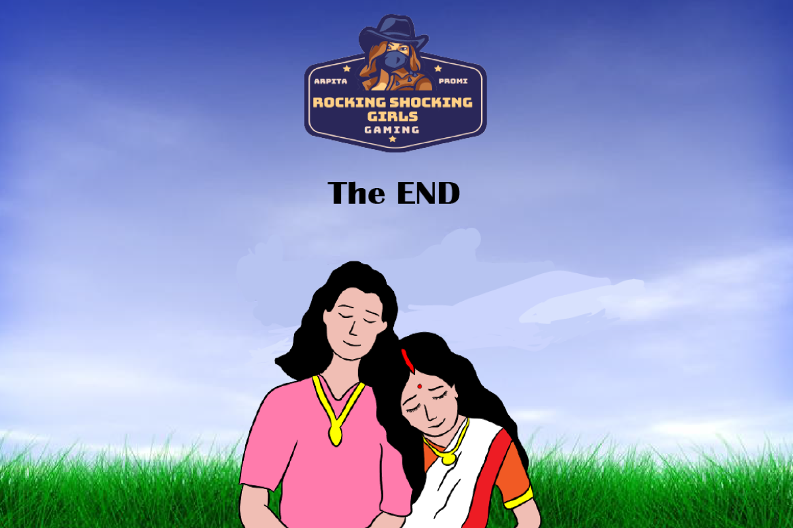

# Behula

Behula is mainly a survival game where Behula faces many dangers while reaching her destination towards heaven.
This game is inspired from Indian mythological character ‘Behula’, who went in a raft towards heaven with her dead husband to get back his life who was bitten by Kalnagini at Devi Manasa’s direction. 

## Inspiration
[Animation of Behula Song by Shunno Band](https://youtu.be/a3-HFoJJPzk)

## Gameplay Instructions:

<strong>The objective of this game is to help Behula to reach the heaven where she will have to face many dangers.</strong>

<h1>This game contains 2 levels.</h1>

<h2>Level 1: </h2>  

In the level 1, tap ‘space’ to make Behula jump whenever you can see any obstacle. Once the level is finished, she can reach his husband’s raft and level 2 will start.

<h2>Level 2: </h2>  

In this level, move Behula with several keys (A for left, D for right, w for up and s for down) and help her move without getting stuck with any obstacles. After completing this level, Behula can take her husband to the heaven and get his life back.</strong>

## Tools Used
<h4>IDE: Netbeans </h4>  
<h4>Characters developing: Adobe Illustrator </h4>  
<h4>Language: Java </h4>  

## Credits:

 
